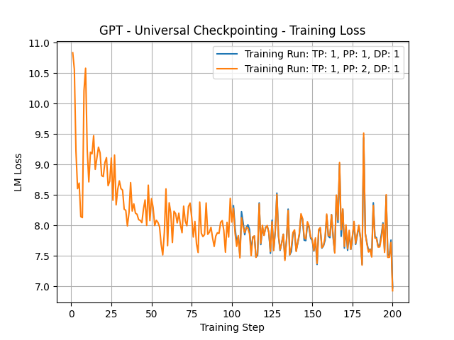

## 📢 News

Universal Checkpointing has been adopted by prominent organizations and research institutions for model pre-training and fine-tuning. Here are some notable adopters:

* [BigScience - BLOOM 176B](https://huggingface.co/bigscience/bloom)
* [Microsoft - Phi-3.5-MoE 42B](https://huggingface.co/microsoft/Phi-3.5-MoE-instruct)
* [University of California, Berkeley - SmileyLlama 8B](https://arxiv.org/abs/2409.02231)
* [Renmin University of China - YuLan-Mini 2.4B](https://arxiv.org/abs/2412.17743)

Moreover, Universal Checkpointing has been tested on:

* **AMD** cluster by AMD researchers. AMD will share experience at [FMS'25](https://futurememorystorage.com): "Flexible, Efficient, Resilient Training on AMD GPUs with DeepSpeed UCP"
* [Aurora **Intel** GPU cluster](https://www.alcf.anl.gov/aurora) by [Argonne National Lab](https://www.anl.gov)

## 📙 About

Universal Checkpointing (UCP) is a novel checkpointing system that enables flexible and efficient model training with reconfigurable parallelism. We have implemented and open-sourced Universal Checkpointing in DeepSpeed.

Why Universal Checkpointing?

- ✨ **Comprehensive Parallelism Support**: Supports DP, ZeRO-DP (Stage 1/2/3), PP, TP, SP, and any combination of these parallel strategies.
- ✨ **Versatile Model Architecture**: Compatible with Dense, MoE, and GQA model architectures.
- ✨ **Optimized Performance**: Efficient reconfiguration with minimal overhead.
- ✨ **Seamless Integration**: No code refactoring required, orthogonal to existing checkpoint saving techniques.

Want to know more details? Read our paper & blogs!

- **Paper**: [ATC'25 paper](https://www.usenix.org/conference/atc25)
- **Blog**: [DeepSpeed](https://www.deepspeed.ai/tutorials/universal-checkpointing/), [Megatron-DeepSpeed](https://github.com/deepspeedai/Megatron-DeepSpeed/blob/main/examples_deepspeed/universal_checkpointing/README.md), [SSAIL](https://supercomputing-system-ai-lab.github.io/projects/ucp)


## 🔥 Quick Start

### Install Required Dependencies

```
pip install transformers pandas numpy ninja hjson msgpack tqdm psutil accelerate future pybind11
```

### Install DeepSpeed
Clone the DeepSpeed repository, switch to the `ucp` branch, and install it in editable mode and point `DEEPSPEED_DIR` to the folder:
<details>
<summary>Expand for DeepSpeed installation</summary>

```
git clone https://github.com/xylian86/DeepSpeed.git
cd DeepSpeed
git checkout ucp
pip install -e .
export DEEPSPEED_DIR="$PWD"
```
</details>

### Install NVIDIA Apex
Clone the Apex repository, switch to the `23.05-devel` branch, and install with CUDA extensions enabled:
<details>
<summary>Expand for Apex installation</summary>

```
git clone https://github.com/NVIDIA/apex
cd apex
git checkout 23.05-devel
pip install -r requirements.txt
pip install --global-option="--cpp_ext" --global-option="--cuda_ext" --no-cache -v --disable-pip-version-check --no-build-isolation .
```
</details>

### Download Megatron-DeepSpeed Repository
Clone the Megatron-DeepSpeed repository and switch to the `ucp` branch and point `MEGATRON-DEEPSPEED_DIR` to the folder:
<details>
<summary>Expand for Megatron-DeepSpeed download</summary>

```
git clone git@github.com:xylian86/Megatron-DeepSpeed.git
cd Megatron-DeepSpeed
git checkout ucp
export MEGATRON_DEEPSPEED_DIR="$PWD"
```
</details>

### Prepare Training Datasets
For convenience, we provide large binary dataset files that you can use directly; due to their size, they are tracked with Git LFS. To download and verify:

```bash
# 1. Install Git LFS
# Ubuntu/Debian:
sudo apt-get install git-lfs
# macOS (Homebrew):
brew install git-lfs

# 2. Initialize Git LFS and pull the data
git lfs install
git lfs pull

# 3. Verify the dataset
ls training_datasets/gpt2_text_document.bin  # should be ~400MB
```

**Note**: Feel free to contact us if you encounter any issues setting up the environment or using the provided artifacts.

## Tiny example (Minimal Requirement: 2 GPUs)

### Example 1
`Source Parallelism Strategy` → 2 GPU: PP=2
`Target Parallelism Strategy` → 1 GPU

Step 1: Create distributed checkpoint.
`bash examples/ex1/init_train_source.sh`

Step 2: Convert ZeRO checkpoint of iteration 100 to Universal format.
`bash examples/ex1/convert.sh`

Step 3: Resume training with Universal checkpoint of iteration 100.
`bash examples/ex1/resume_train_target.sh`

Step 4: Plot the LM loss from both `source` and `target`.
`python3 tb_analysis/tb_analysis_script.py --tb_dir . --tb_event_key "lm-loss-training/lm loss" --plot_name "ucp_training_loss.png" --plot_title "GPT - Universal Checkpointing - Training Loss" --skip_csv`

This command generates a plot overlaying the loss curves from both runs:
 - Source run (PP=2, steps 1–100)
 - Target run (PP=1, steps 101–200)

Step 5: Validate the Correctness of UCP
Verify that the two curves align seamlessly: the loss from steps 101–200 (2 GPUs) should match the loss observed in steps 101–200 (1 GPU) after loading the universal checkpoint saved at step 100. The resulting figure should resemble the one below.

<div align="center">
  

  *Figure: Training LM loss curve for first 200 training steps of Step 1 (PP=2) and training steps 101 to 200 of Step 3 (PP=1), which was loaded using the Universal Checkpoint*
</div>

## 📜 Citation

```bibtex
@inproceedings{ucp,
  title = {Universal Checkpointing: A Flexible and Efficient Distributed Checkpointing System for Large-Scale DNN Training with Reconfigurable Parallelism},
  author = {Lian, Xinyu and Jacobs, Sam Ade and Kurilenko, Lev and Tanaka, Masahiro and Bekman, Stas and Ruwase, Olatunji and Zhang, Minjia},
  booktitle = {2025 USENIX Annual Technical Conference},
  year = {2025}
}
```

## 🙏 Acknowledgement

- [DeepSpeed](https://github.com/deepspeedai/DeepSpeed)
